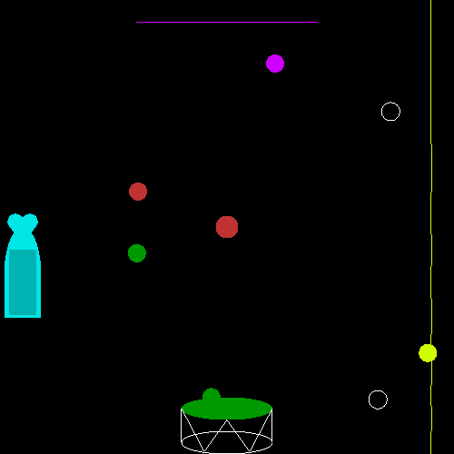

# Wild Open Space

Game or Synthesizer?

**See video demo [here](https://youtu.be/HFvsDB2GHOs).**

---------

In this silly game, you use a remote sending OSC messages to the program, and playing it and making sounds.

This project is an extension from the final coursework in the [Physics-Based Sound Synthesis for Games and Interactive Systems](https://www.kadenze.com/courses/physics-based-sound-synthesis-for-games-and-interactive-systems-iv/info) course of Stanford University. The sound engine is written in ChucK. I used several unit generators and STKs built in ChucK for the collision sound with kinds of physics model method implemented like Karplus-Strong algorithm. A physics engine is also built in for the movements of particles. 

There is a square pad on the remote, TouchOSC in my case, and when you touch on the square, it will implant a "force source" to the corresponding location of the screen, and the force will pull all the balls towards to it. When your finger releases from the screen, the force then disappears. Since it is a multi-touch pad, you can implant 3 force source at most. Yhe sources also interact with each other, just like gravity in space.

Below the xy-pad, There are two buttons and a knob. The knob controls damping in the space, also give a big reverb while damping is big. The left button is a randomizer, whenever you touch it, the balls got a new velocity. The right button is a brake, whenever you touch it, the balls stops moving for moment.

For the sound part, there are 5 different tones. First of all, the balls get their each timbre when colliding. The left bottle gives a flute sound, with pitch corresponding to the hit point. The right string acts as a two-string mandolin, and gets a wider pitch range. The top bar has 3 sine wave oscillators, acting as a pad with chord. And the bottom drum is a set of percussions. Additionally, the middle peg is a weired sticker, whenever the balls touch it, the time "stops" for a little while, while the reverb getting bigger and bigger, as if the sound wave is still propagating.

And all the sounds is panned to the horizontal position of the collisions. So it would be more interesting(or more silly) if you use a headphone or stereo speakers.

-------

## Credits

* The PongView framework based on OpenGL is written by Perry R. Cook: https://www.cs.princeton.edu/~prc/

* Chuck and MiniAudicle: https://chuck.cs.princeton.edu/

* TouchOSC and TouchOSC Editor: https://hexler.net/software/touchosc
